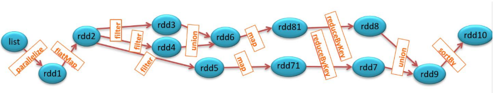
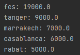
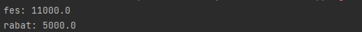

# TP3 : Traitement parallèle et distribué avec Spark 
## Exercice 1 : Création d'un lignage de processus les RDDs


### Dataset
```json
[
  {"name": "Alice", "age": 20, "grade": "A"},
  {"name": "Bob", "age": 22, "grade": "B"},
  {"name": "David", "age": 23, "grade": "A"},
  {"name":  "Ben", "age": 22, "grade": "B"},
  {"name": "Adam", "age": 23, "grade": "A"},
  {"name": "Bob", "age": 22, "grade": "B"},
  {"name": "Eva", "age": 20, "grade": "B"},
  {"name": "Charlie", "age": 20, "grade": "B"}
]
```
### Code source (Java) 🚀
```java
public class Exercice1 {
    public static void main(String[] args) {
        SparkSession ss = SparkSession.builder().appName("Spark RDDs").master("local[*]").getOrCreate();
        JavaSparkContext sc = new JavaSparkContext(ss.sparkContext());

        Dataset<Row> students = ss.read().json("src/main/resources/students.json");

        List<String> studentNames = students
                .select("name")
                .toJavaRDD()
                .map(row -> row.getString(0))
                .collect();

        // RDD1: Creating the initial RDD by parallelizing the student names
        JavaRDD<String> rdd1 = sc.parallelize(studentNames);

        // RDD2: Transforming RDD1 using flatMap
        JavaRDD<String> rdd2 = rdd1.flatMap(s -> Arrays.asList(s.split(" ")).iterator());

        // RDD3 & RDD4: Filtering rdd2
        JavaRDD<String> rdd3 = rdd2.filter(s -> s.startsWith("A"));
        JavaRDD<String> rdd4 = rdd2.filter(s -> s.startsWith("B"));

        // RDD6: Union of RDD3 and RDD4
        JavaRDD<String> rdd6 = rdd3.union(rdd4);

        // RDD8: Performing map and reduceByKey operations on RDD6
        JavaRDD<String> rdd8 = rdd6.mapToPair(s -> new Tuple2<>(s, 1))
                .reduceByKey((a, b) -> a + b)
                .map(pair -> pair._1() + ": " + pair._2());

        // RDD5: Filtering rdd2
        JavaRDD<String> rdd5 = rdd2.filter(s -> s.startsWith("C"));

        // RDD7: Performing map and reduceByKey operations on RDD5
        JavaRDD<String> rdd7 = rdd5.mapToPair(s -> new Tuple2<>(s, 1))
                .reduceByKey((a, b) -> a + b)
                .map(pair -> pair._1() + ": " + pair._2());

        // RDD9: Union of RDD8 and RDD7
        JavaRDD<String> rdd9 = rdd8.union(rdd7);

        // RDD10: Sorting RDD9
        JavaRDD<String> rdd10 = rdd9.sortBy(s -> s, true, 1);

        // Action: Printing RDD10
        rdd10.collect().forEach(System.out::println);

        sc.stop(); // Stop the SparkContext
    }
}
```

### Résultat ✅


## Exercice 2 : Analyse de données de ventes
### Dataset
```text
2019 rabat project1 5000
2020 casablanca project2 6000
2021 marrakech project3 7000
2019 fes project4 8000
2023 tanger project5 9000
2020 fes project4 8000
2019 fes project4 3000
```
### Tache 1 : Calculer le total des ventes par ville
#### Code source (Java) 🚀
```java
public class Task1 {
    public static void main(String[] args) {
        SparkSession ss = SparkSession.builder().appName("Spark SQL with Text Files").master("local[*]").getOrCreate();
        JavaSparkContext sc = new JavaSparkContext(ss.sparkContext());

        // Read the ventes.txt file
        JavaRDD<String> dataRDD = sc.textFile("src/main/resources/ventes.txt");

        // Filter the data to get only 'ville' and 'prix' columns
        JavaRDD<String> filteredDataRDD = dataRDD.map(line -> {
            String[] columns = line.split(" ");
            return columns[1] + " " + columns[3];
        });

        // Create pairs of (ville, prix)
        JavaPairRDD<String, Double> pairsRDD = filteredDataRDD.mapToPair(line -> {
            String[] columns = line.split(" ");
            return new Tuple2<>(columns[0], Double.parseDouble(columns[1]));
        });

        // Reduce by key to get the total price for each city
        JavaPairRDD<String, Double> reducedRDD = pairsRDD.reduceByKey((a, b) -> a + b);

        // Sort the data by price
        JavaPairRDD<Double, String> sortedRDD = reducedRDD.mapToPair(pair -> new scala.Tuple2<>(pair._2(), pair._1()))
                .sortByKey(false);

        // Print the result
        sortedRDD.collect().forEach((pair) -> System.out.println(pair._2() + ": " + pair._1()));
    }
}
```

### Résultat ✅


### Tache 2 : Calculer le total des ventes par ville pour une année donnée
#### Code source (Java) 🚀
```java
import org.apache.spark.api.java.JavaPairRDD;
import org.apache.spark.api.java.JavaRDD;
import org.apache.spark.api.java.JavaSparkContext;
import org.apache.spark.sql.SparkSession;
import scala.Tuple2;

public class Task2 {
    public static void main(String[] args) {
        SparkSession ss = SparkSession.builder().appName("Spark SQL with Text Files").master("local[*]").getOrCreate();
        JavaSparkContext sc = new JavaSparkContext(ss.sparkContext());

        String date = "2019";

        // Read the ventes.txt file
        JavaRDD<String> dataRDD = sc.textFile("src/main/resources/ventes.txt");

        // Filter the data to get only 'ville' and 'prix' for a given 'date'
        JavaRDD<String> filteredDataRDD = dataRDD.filter(line -> line.startsWith(date)).map(line -> {
            String[] columns = line.split(" ");
            return columns[1] + " " + columns[3];
        });

        // Create pairs of (ville, prix)
        JavaPairRDD<String, Double> pairsRDD = filteredDataRDD.mapToPair(line -> {
            String[] columns = line.split(" ");
            return new Tuple2<>(columns[0], Double.parseDouble(columns[1]));
        });

        // Reduce by key to get the total price for each city
        JavaPairRDD<String, Double> reducedRDD = pairsRDD.reduceByKey((a, b) -> a + b);

        // Sort the data by price
        JavaPairRDD<Double, String> sortedRDD = reducedRDD.mapToPair(pair -> new scala.Tuple2<>(pair._2(), pair._1()))
                .sortByKey(false);

        // Print the result
        sortedRDD.collect().forEach((pair) -> System.out.println(pair._2() + ": " + pair._1()));
    }
}
```

### Résultat ✅

